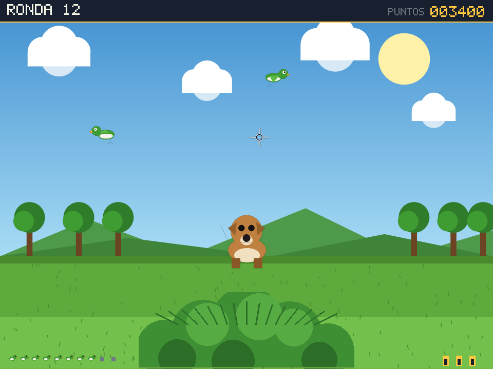

# Duck Hunt

Recreación del clásico de NES hecha con pygame. Los patos cruzan el cielo y
hay que abatirlos con la mira antes de que escapen, así que cada tiro cuenta.

Ventana de 960×720 a 60 FPS, diez patos por ronda y tres disparos para cada
uno. El arte y el sonido no están dibujados a mano: los genera
`tools/generate_assets.py`, que los compone con pygame y con la biblioteca
estándar.



---

## Instalación

El juego necesita **pygame**, y su rueda no compila contra las versiones más
recientes de Python (3.14 todavía no tiene rueda). Lo más seguro es fijar la
versión:

```bash
cd duck-hunt
uv venv --python 3.13 .venv
uv pip install -r requirements.txt
```

Con `python3.13 -m venv` también funciona:

```bash
python3.13 -m venv .venv
.venv/bin/pip install -r requirements.txt
```

### Ejecutar

```bash
./bin/duck-hunt
```

O directamente, si el entorno ya está activo:

```bash
python run.py
```

`run.py` detecta que pygame no se puede importar y se relanza solo con
`.venv/bin/python`, que es el único intérprete con la rueda instalada. Si
tampoco existe ese `.venv`, el error dice exactamente qué comando ejecutar.

### Comprobación rápida

```bash
./bin/duck-hunt --self-test
```

Arranca el juego en modo headless, carga los recursos, simula unos fotogramas y
sale. Es lo que usa el empaquetado para verificar el binario.

---

## Controles

| Acción | Tecla / ratón |
| --- | --- |
| Disparar | Clic izquierdo |
| Elegir opción del menú | `↑` `↓` |
| Empezar partida / siguiente ronda | `Enter` o `Espacio` |
| Volver al menú | `Esc` |
| Pausa | `F10` (o `Esc` para salir de la pausa) |
| Silenciar el sonido | `M` |
| Pantalla completa | `F11` |
| Minimizar a la bandeja | `Esc` en el menú, o cerrar la ventana |
| Mostrar / salir desde la bandeja | Menú del indicador |

> El cursor del ratón se oculta porque la mira es un punto de mira dibujado en
> pantalla. Cerrar la ventana **no** termina el juego: se minimiza y sigue vivo
> en la bandeja. Para salir de verdad hay que elegir `SALIR` en el menú.

---

## Reglas

Las mismas que en el juego original:

| Regla | Valor |
| --- | --- |
| Patos por ronda | 10 |
| Aciertos necesarios para pasar | 6 |
| Disparos por pato | 3 |
| Patos simultáneos, rondas 1-10 | 1 |
| Patos simultáneos, rondas 11-20 | 2 |
| Patos simultáneos, desde la ronda 21 | 3 |
| Puntos por pato | 100 |
| Bonus de ronda perfecta (10/10) | 1000 |
| Bonus final | 10 × disparos sin usar |

Si se fallan los tres disparos de un pato, escapa. La ronda acaba cuando todos
los patos de ella han volado, y si no se han abatido seis, la partida termina.

El perro da el veredicto de cada pato: salta por encima de la hierba cuando lo
abates y se ríe cuando se te escapa. Los patos pasan por detrás del matorral,
igual que en el original.

Las mejores puntuaciones se guardan en
`~/.local/share/duck-hunt/high_scores.json` (siguiendo XDG), no dentro del
directorio de instalación: así una instalación en `/usr`, que es de solo
lectura, no impide guardar récords. Si ya existía el fichero antiguo
`data/high_scores.json`, se lee también.

---

## Recursos generados

No hay ni un solo PNG o WAV hecho a mano. `tools/generate_assets.py` los
compone:

```bash
.venv/bin/python tools/generate_assets.py
```

Es idempotente: al volver a ejecutarlo sale exactamente lo mismo. Solo hace
falta tocarlo si cambian los sprites o los efectos.

**Imágenes** — patos con sus tres fotogramas de aleteo, pato abatido, perro en
tres poses, fondo con colinas y línea de árboles, matorral, mira, icono y
logo. Se dibujan a cuatro veces su tamaño y se reducen con `smoothscale`, que
es lo que da el aspecto suave.

**Fuente** — una fuente de píxeles de 5×7 dibujada a mano en
`assets/fonts/font_atlas.png`, con su mapa de posiciones en
`font_metrics.json`. Se eligió un mapa de bits en vez de un TTF por dos motivos:
el aspecto es idéntico en cualquier equipo y el binario congelado no depende
de las fuentes instaladas. `src/ui/fonts.py` la usa siempre que esté, y si
falta recurre a la fuente por defecto de pygame.

**Sonido** — diez efectos y una pista de menú sintetizados con `wave` y
`math`. La música es una composición original escrita en el propio script, no
el tema del juego original.

---

## Estructura

```
run.py                      Punto de entrada; relanza en el venv si hace falta
bin/duck-hunt               Lanzador en bash
scripts/build.sh            Empaquetado para Linux
tools/generate_assets.py    Generador de sprites, fuente y sonidos
tools/entrypoint.py         Entrada del binario congelado (--self-test)
src/config.py               Todas las constantes del juego
src/assets.py               Rutas, tanto en repo como en binario congelado
src/sprites.py              Carga y recorte de imágenes
src/game.py                 Reglas: rondas, puntuación y estados
src/states.py               Estados de la aplicación
src/high_scores.py          Persistencia de los récords
src/entities/duck.py        Vuelo, escape y caída con gravedad
src/entities/dog.py         Salto parabólico y poses
src/entities/grass.py       Matorral que oculta a los patos
src/entities/bullet.py      Destello del disparo
src/ui/pixel_font.py        Fuente de mapa de bits
src/ui/fonts.py             Selección de fuente
src/ui/hud.py               Marcador
src/ui/screens.py           Menús y pantallas de resumen
src/ui/crosshair.py         Mira
src/ui/text.py              Ayudas de dibujo de texto
src/audio/sound_manager.py  Carga y reproducción de sonidos
src/gnome_app.py            Integración con el ciclo de vida de GTK
src/indicator.py            Indicador de bandeja
assets/                     Imágenes, sonidos, fuente e icono
data/                       Atajo de escritorio
tests/                      Tests con SDL en modo dummy
packaging/                  Metadatos de los paquetes de Linux
```

---

## Tests

```bash
uv pip install -r requirements-dev.txt
SDL_VIDEODRIVER=dummy SDL_AUDIODRIVER=dummy .venv/bin/python -m pytest tests
```

Los tests no abren ninguna ventana ni suenan: Pygame arranca con el
controlador de vídeo `dummy`. Cubren el vuelo y el escape del pato, la caída con
gravedad, el salto del perro, el límite de disparos, el desarrollo de las
rondas, los bonus, los récords y que todos los recursos cargan.

---

## Empaquetado

```bash
scripts/build.sh            # todo
scripts/build.sh binary     # solo el binario
scripts/build.sh deb        # .deb
scripts/build.sh appimage   # AppImage
scripts/build.sh flatpak    # Flatpak
scripts/build.sh test       # comprueba el binario
```

El binario se compila con PyInstaller, así que **no necesita python ni pygame
en el sistema**: lleva dentro el intérprete, las librerías y los recursos.

| Artefacto | Dónde se instala |
| --- | --- |
| `dist/duck-hunt_1.0.0_amd64.deb` | `/usr/games/duck-hunt` |
| `dist/duck-hunt-1.0.0-x86_64.AppImage` | se ejecuta directamente |

```bash
sudo apt install ./dist/duck-hunt_1.0.0_amd64.deb
```

o, sin instalar nada:

```bash
./dist/duck-hunt-1.0.0-x86_64.AppImage
```

### Flatpak

El manifiesto está en `packaging/com.duckhunt.Game.yml` y pasa el linter de
Flathub, pero **no viene compilado**. Para generarlo:

```bash
flatpak install --user -y flathub org.flatpak.Builder
scripts/build.sh flatpak
```

Dos avisos honestos sobre este formato:

- El módulo solo copia el binario que produce PyInstaller; no compila nada
  dentro del sandbox. Es porque el SDK de freedesktop lleva Python 3.14, para el
  que pygame no publica rueda, y dentro del sandbox no hay red. A cambio, el
  manifiesto necesita `scripts/build.sh binary` ejecutado antes y no es
  reproducible desde el código fuente por sí solo. Para publicar en Flathub
  haría falta un SDK con Python 3.13.
- `flatpak-builder` puede no ver el SDK aunque esté instalado en tu
  instalación de usuario. Si falla con `Sdk not installed`, instálalo también en
  la de sistema: `flatpak install --system flathub org.freedesktop.Sdk//26.08`.

---

## Integración con GNOME: opcional a propósito

`gi` (PyGObject) solo está disponible para el intérprete del sistema, no para
el entorno virtual del proyecto, que es el que tiene pygame. La integración con
la bandeja y con el ciclo de vida de GNOME es por tanto opcional: el juego
arranca igual sin ella, solo que sin icono en la bandeja y sin pantalla
completa gestionada por GNOME.

Con el binario congelado, en cambio, funciona siempre: el AppImage y el `.deb`
llevan su propio Python y pueden usar la bandeja si el sistema tiene PyGObject.